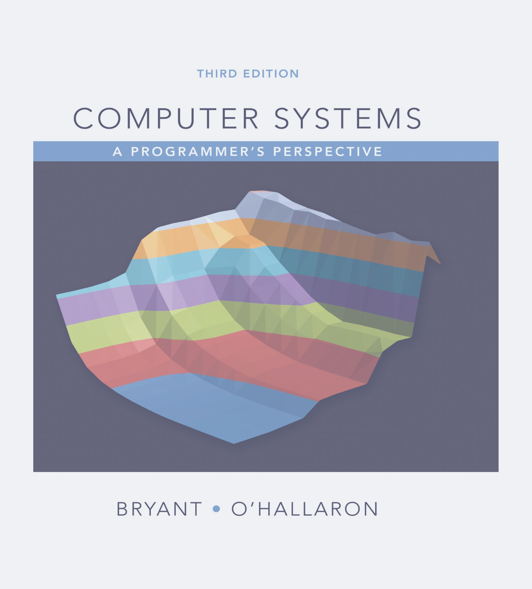

# My notes and solutions to 'Computer Systems a Programmer's Perspective'

A great resource to compare solutions is the dreamanddead's site [CSAPP-3E-SOLUTIONS](https://dreamanddead.github.io/CSAPP-3e-Solutions/)

Amdahl's la states: 

$$
T_o/T_n = \frac{1}{(1-\alpha) + \alpha / k}
$$
