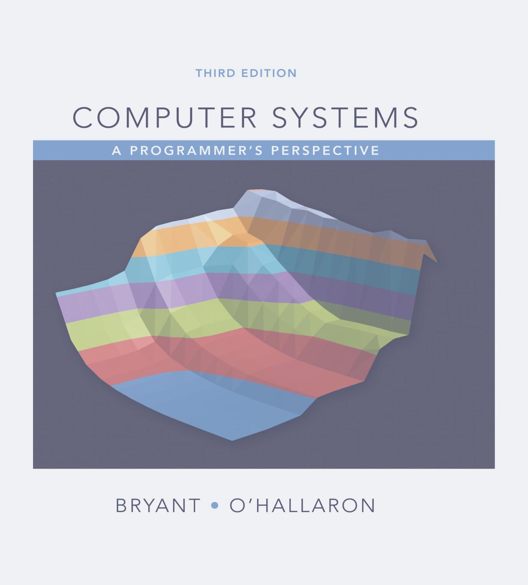

# My notes and solutions to 'Computer Systems a Programmer's Perspective'

Get a solid foundation to understand low level concepts on computer systems as a basis for GPU programming. 

The book is written for systems programmers who need to understand everything from logic gates to OS internals. We'll focus on a targeted subset of the entirety of the book - the parts that explain why hardware behaves the way it does, because GPU programming is fundamentally about exploiting hardware behavior at a low level.

